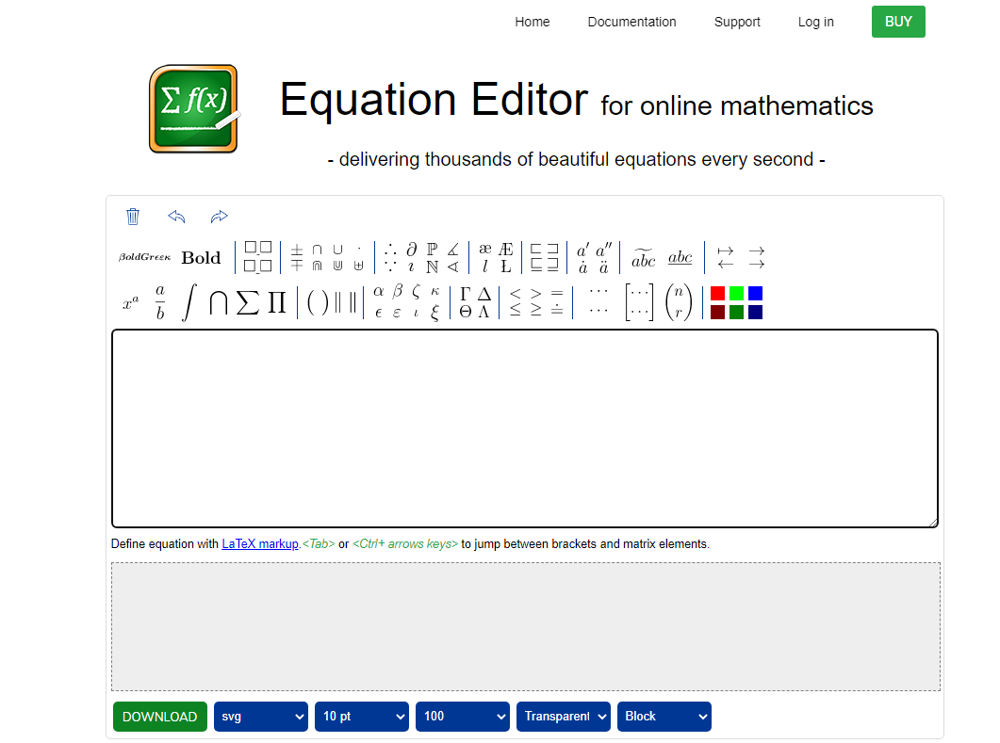

```{r, echo=FALSE, out.width="100%"}
knitr::include_graphics("Fig/Diapositiva 4.JPG")
```

> **TEMAS CENTRALES DEL MÓDULO**

> Instalación

> Como empezar primer informe con RMarkdown

> Documento básico de RMarkdown

> Características de los documentos básicos de Rmarkdown

> Edición del formato de los textos

> Incluir código de R en el informe. Opciones de los chunk

> Caso de estudio

> Cambiar el tema (Theme)

> Otros tipos de documentos-ppt

# Introducción

```{r, echo=FALSE, out.width="30%"}

```

[Página de Rmarkdown](https://rmarkdown.rstudio.com/)

```{r  echo = F, fig.cap = "Página web de Rmarkdown"}

  

```

## Ventajas y características

-   Permite generar informes a partir de R.
-   Utiliza el lenguaje Markdown para enriquecer el informe final.
-   Permite incluir texto, comandos de R, imágenes y gráficos a un documento.
-   Permite que se reproduzca el análisis realizado y actualizarlo.

## Instalación

Al igual que con las unidades anteriores, para usar estos paquetes debemos tener instalados R y Rstudio. Si desea generar una salida PDF, necesitará instalar LaTeX. Para los usuarios que no hayan instalado LaTeX anteriormente, le recomendamos que instale TinyTeX (<https://yihui.name/tinytex/>)

    install.packages("rmarkdown")
    install.packages("tinytex")

Para empezar en RStudio, debe crear un nuevo archivo Rmd desde el menú Archivo -\> Nuevo archivo -\> R Markdown.

```{r, echo=FALSE, out.width="100%"}

```

Se puede elegir el formato de salida del informe:

-   página web que se podrá ver con un navegador,
-   documento Word o
-   documento PDF. De cualquier manera estos formatos son intercambiables.

```{r, echo=FALSE, out.width="100%"}

```

Al darle Ok se abrirá un fichero que incluye contenido de texto y de lenguaje RMarkdown

```{r, echo=FALSE, out.width="100%"}

```

## Tipos de reportes

```{r, echo=FALSE, out.width="100%"}

```

En R Mardown se puede crear muchos tipos de reportes a partir de un único archivo \*.Rmd.

Se pueden generar documentos:

-   HTML, PDF, MS_Word,
-   ODT, RTF, presentaciones pptx,
-   Beamer, slidy.js, ioslides y slideshow.js slideshows; y sitios web, paneles,libros, folletos,
-   viñetas de paquetes, etc.

### Tareas en RPubs

Existen una gran cantidad de tareas en el sitio web <https://RPubs.com> (una plataforma de publicación gratuita proporcionada por RStudio).

```{r  echo = F, fig.cap = " "}
if (!file.exists('fig/RPubs.png')) {
  webshot::webshot("https://RPubs.com/", 
                   "fig/RPubs.png",
                   cliprect = c(0, 0, 1000, 1000))
} else {
  
}
```

Muestra que RMarkdown es lo suficientemente fácil y conveniente para que los estudiantes hagan sus tareas.

Para poder publicar en este sitio, deben registrarse y seguir las siguientes instrucciones y enlace en la parte marcada en la imagen:

```{r, echo=FALSE, out.width="100%"}

```

## Libros

`bookdown`, es un paquete R que permite escribir libros e informes largos con múltiples archivos Rmd. A partir de este paquete surgieron una gran cantidad de libros, muchos tienen versiones gratuitas en línea que pueden encontrarse <https://bookdown.org>.

```{r  echo = F, fig.cap = " "}
if (!file.exists('fig/bookdown.png')) {
  webshot::webshot("https://bookdown.org/", 
                   "fig/bookdown.png",
                   cliprect = c(0, 0, 1000, 2000))
} else {
  
}
```

## Blogs

Utilizando el paquete de R, blogdown se pueden crear sitios web (estáticos) de uso general (webs personales, blogs, ...) con R Markdown. <https://bookdown.org/yihui/blogdown/>

```{r, echo=FALSE, out.width="60%"}
knitr::include_graphics("fig/blogdown.jpg")
```

# Documento básico de R Markdown

R Markdown fue diseñado para reproducir de forma fácil tanto el código como texto en el mismo documento. un documento R Markdown mínimo, que debería ser un archivo de texto sin formato, con la extensión convencional .Rmd:

Hay tres componentes básicos de un documento de R Markdown:

-   **los metadatos**
-   **el texto y**
-   **el código**

Los metadatos se escriben entre un par de tres guiones

    ---
    title: "Untitled"
    author: "Teresa Boca"
    date: "9/16/2023"
    output: html_document
    ---

La sintaxis de los metadatos es YAML (<https://en.wikipedia.org/wiki/YAML>)

La sintaxis para el texto es Markdown

Un fragmento de código (chunk) comienza con tres comillas como:

```{r}
# acá van los comandos
```

## Formatos de salidas

Una vez seleccionado el formato de salida del informe, aparecerá en los metadatos que contiene por defecto el título, autor, fecha y formato de salida del informe. En este caso he seleccionado como formato de salida una página Web por lo que pone "html_document".

Podremos generar informes en Word, PDF o HTML (formato página web visible con cualquier navegador).En cada formato cambia el aspecto del mismo.

```{r echo=FALSE,  fig.align='center', out.height="80%", out.width="80%"}

knitr::include_graphics('fig/imagen_9.jpg')

```

### Salida en PDF

-   Los informes que generan un PDF usan tipografías tipo Times, con tamaño estándar para el cuerpo de 13 y 16 para títulos.
-   Para editar ficheros PDF se necesitan herramientas especiales como Adobe Acrobat u otras alternativas.
-   Se puede cambiar o editar el propio generador del PDF para obtener un documento final, que no necesite ninguna edición.

### Salida en HMTL

-   Es útil para mantener actualizadas páginas web con análisis, o centros de mandos con gráficos, etc. Es visible en cualquier navegador o explorador.
-   Se puede editar con cualquier editor de páginas webs (o incluso con cualquier editor de textos).
-   Pero la idea es no tener que editar el documento final sino editar el generador de informes y obtener el informe final.

### Salida en Word

-   Cuando se genera el informe en fichero Word, el documento es completamente editable.
-   Los gráficos se verán como imágenes en el documento de Word.
-   El título del documento se genera en tipo de letra Calibrí, tamaño 18 puntos, en un color azul marino.
-   El cuerpo del documento usa la tipografía Cambria con tamaño 12.
-   Esto puede cambiar según el sistema operativo, o incluso puede cambiar con actualizaciones siguientes.

# Edición del formato de los textos

Existe mucha bibliografía online y también muchas tablas de referencias, en español podemos encontrar:

<https://www.rstudio.com/wp-content/uploads/2015/03/rmarkdown-spanish.pdf>

```{r echo=FALSE,  fig.align='center', out.width="100%", out.height="100%"}

```

Cualquier texto que se incluya en el fichero generador del informe aparecerá tal cual. Si queremos incluir subtítulos, o caracteres en negrita, o ecuaciones, tendremos que introducir una sintaxis específica. Por ejemplo, para introducir títulos, subtítulos, y cabeceras podemos usar el carácter #. Texto en el generador del informe:

    # Este es el título

    ## Este es un subtítulo

    ### Este es un subsubtítulo

## Formato de palabras o frases

Para resaltar una palabra o una frase debemos ponerla entre doble asteriscos (\*\*), por ejemplo si escribimos:

    Dentro de una frase se pueden resaltar **varias palabras**. 

Dentro de una frase se pueden resaltar **varias palabras**.

Para poner una palabra (o una frase) en cursiva debemos ponerla entre asteriscos simples (\*)

    Dentro de una frase se pueden resaltar *varias palabras*.

Dentro de una frase se pueden resaltar *varias palabras*.

Para ver más referencia también podemos buscarlas en:

```{r echo=FALSE,  fig.align='center', out.width="100%", out.height="100%"}
knitr::include_graphics('fig/imagen_11.JPG')
```

# Incluir código de R en el informe

Una vez que controlamos como poner títulos, subtítulos y cabeceras y texto, podemos incluir análisis y resultados de R en el informe. Para ello debemos escribir el `codigo` de R entre una cabecera y pie que permite interpretar la sintáxis de R incluyendo un trozo o "chunk":

```{r echo=FALSE,  fig.align='center', out.width="100%", out.height="100%"}

```

## Opciones de los chunk

La salida de `chunk` se puede personalizar con las opciones de a traves de argumentos establecidos.En la Guía de referencia de R Markdown se encuentra una lista completa de las opciones de los chunk. Los argumentos más comunes son los siguientes:

-   **include** = FALSE evita que el código y los resultados aparezcan en el archivo terminado. R Markdown todavía ejecuta el código en el fragmento, y los resultados pueden ser utilizados por otros fragmentos. echo = FALSE impide el código, pero no aparecen los resultados en el archivo terminado. Esta es una forma útil de incrustar figuras.
-   **message** = FALSE evita que los mensajes generados por el código aparezcan en el archivo terminado.
-   **warning** = FALSE evita que las advertencias generadas por el código aparezcan en el final.
-   **fig.cap** = "..." agrega un título a los resultados gráficos.

Una vez incluido el chunk, a la derecha aparece un icono que nos muestra como configurar algunas de estas opciones de foma sencilla:

```{r echo=FALSE,  fig.align='center', out.width="100%", out.height="100%"}

```

Por ejemplo queremos definir una nueva variable a utilizar en un análisis posterior: y queremos que se ejecute el código, pero no se muestre en el reporte utizaremos las opción: **include=FALSE**

Para conocer más opciones podemos hacer click en la opción marcada en la imagen:

```{r echo=FALSE,  fig.align='center', out.width="80%", out.height="80%"}
knitr::include_graphics('fig/masopciones.JPG')
```

# Caso de studio: incendios forestales en Argentina

En los últimos meses ha sido noticia en los medios los incendios forestales, en este sitio podemos encontrar información:

<https://datos.gob.ar/dataset/ambiente-incendios-forestales>

```{r  echo = F, fig.cap = " "}
if (!file.exists('fig/ambiente.png')) {
  webshot::webshot("https://datos.gob.ar/dataset/ambiente-incendios-forestales", 
                   "fig/ambiente.png",
                   cliprect = c(0, 0, 1000, 500))
} else {
  
}
```

La base de datos *incendios_cantidad_causas_provincia.csv* se encuentra adjunta en la plataforma del curso

## Lectura de bases de datos

```{r message=TRUE, warning=TRUE}

focos <- readxl::read_excel("incendios_cantidad_causas_provincia.xlsx")
names(focos)
summary(focos)
```

```{r message=TRUE, warning=TRUE, include=FALSE}
library(gridExtra)
library(grid)
library(dplyr)
por_anio<-focos%>%
  group_by(fecha) %>%
  summarise(T.negligencia=round((sum(negligencia)/sum(total)),2)*100, 
            T.intencional=round((sum(intencional)/sum(total)),2)*100,
            T.natural=round((sum(natural)/sum(total)),2)*100,
            T.desconocida=round((sum(desconocida)/sum(total)),2)*100)
```

## ¿Qué informamos?

Supongamos que queremos armar un informe con estos tres objetos:

**Gráfico causas a través de los años en porcentaje**

```{r echo=FALSE, message=TRUE, warning=TRUE}
library(ggplot2)
p1<-ggplot(por_anio, aes(fecha, T.negligencia)) 
g1<-p1+ geom_col(fill="blue")+ylim(0,100)+ theme_bw()+ xlab(" ")

p2<-ggplot(por_anio, aes(fecha, T.intencional)) 
g2<-p2+ geom_col(fill="red")+ylim(0,100)+ theme_bw()+ xlab(" ")

p3<-ggplot(por_anio, aes(fecha, T.natural)) + xlab(" ")
g3<-p3+ geom_col(fill="green")+ylim(0,100)+ theme_bw()

p4<-ggplot(por_anio, aes(fecha, T.desconocida)) 
g4<-p4+ geom_col()+ylim(0,100)+ theme_bw()

grid.arrange(g1, g2, g3, g4, nrow=4)

```

**Tabla con los focos de incendio por provincia en un año** particular

```{r echo=FALSE, message=TRUE, warning=TRUE}
library(flextable)
i=2017
provincia_data <- subset(focos,fecha==i)

por_provincia<- provincia_data%>%
  group_by(provincia) %>%
  summarise( Porc.negligencia=round((sum(negligencia)/sum(total)),2)*100, 
                 Porc.intencional=round((sum(intencional)/sum(total)),2)*100,
                 Porc.natural=round((sum(natural)/sum(total)),2)*100,
                 Porc.desconocida=round((sum(desconocida)/sum(total)),2)*100,
                 Total.incendios=sum(total))


Tabla_incendios<-flextable(por_provincia)
Tabla_incendios <- autofit(Tabla_incendios)
Tabla_incendios<- add_header_lines(Tabla_incendios, values = paste("Focos incendios total",i))
Tabla_incendios 

```

**Gráfico de torta para una provincia dada**

```{r echo=FALSE, message=TRUE, warning=TRUE}
j="Chubut"
provincia_data <- subset(por_provincia,provincia==j)

# Creación data
data <- data.frame(
  causa=colnames(provincia_data)[2:5],
  porcentaje=as.numeric(provincia_data[1,2:5]))

# Gráfico de torta básico
ggplot(data, aes(x=" ", y=porcentaje, fill=causa)) +
geom_bar(stat="identity", width=3) +
geom_text(aes(label = paste0(round(porcentaje), "%")), position = position_stack(vjust = 0.5)) +
labs(x = NULL, y = NULL, fill = NULL, title =paste("Causa focos incendios",j))+
coord_polar("y", start=0)+ 
theme(axis.line = element_blank(), axis.text = element_blank(),axis.ticks = element_blank())


```

Los pasos a seguir serian:

-   1.- Lectura de bases de datos.
-   2.- Estimación del porcentaje por año.
-   3.- Gráfico causas a través de los años en porcentaje.
-   4.- Tabla con los focos de incendio por provincia en un año particular.
-   5.- Gráfico de torta por provincia.

Para lo gráficos utilizaremos la librería `ggplot2` ya vista.

```{r  echo = F, fig.cap = " "}
if (!file.exists('fig/ggplot2.png')) {
  webshot::webshot("https://ggplot2.tidyverse.org/", 
                   "fig/ggplot2.png",
                   cliprect = c(0, 0, 1000, 1000))
} else {
  
}
```

Para generar tablas podemos librería `flextable()`

```{r  echo = F, fig.cap = " "}
if (!file.exists('fig/flextable.png')) {
  webshot::webshot("https://www.r-pkg.org/pkg/flextable", 
                   "flextable.png",
                   cliprect = c(0, 0, 1000, 1000))
} else {
  
}
```

## Lectura de bases de datos

```{r message=TRUE, warning=TRUE}

focos <- readxl::read_excel("incendios_cantidad_causas_provincia.xlsx")
names(focos)
summary(focos)
```

## Estimación del porcentaje por año

```{r message=TRUE, warning=TRUE}
library(gridExtra)
library(grid)
por_anio<-focos%>%
  group_by(fecha) %>%
  summarise(T.negligencia=round((sum(negligencia)/sum(total)),2)*100, 
            T.intencional=round((sum(intencional)/sum(total)),2)*100,
            T.natural=round((sum(natural)/sum(total)),2)*100,
            T.desconocida=round((sum(desconocida)/sum(total)),2)*100)

```

## Gráfico causas a través de los años en porcentaje

```{r message=TRUE, warning=TRUE}
library(ggplot2)
p1<-ggplot(por_anio, aes(fecha, T.negligencia)) 
g1<-p1+ geom_col(fill="blue")+ylim(0,100)+ theme_bw()+ xlab(" ")

p2<-ggplot(por_anio, aes(fecha, T.intencional)) 
g2<-p2+ geom_col(fill="red")+ylim(0,100)+ theme_bw()+ xlab(" ")

p3<-ggplot(por_anio, aes(fecha, T.natural)) + xlab(" ")
g3<-p3+ geom_col(fill="green")+ylim(0,100)+ theme_bw()

p4<-ggplot(por_anio, aes(fecha, T.desconocida)) 
g4<-p4+ geom_col()+ylim(0,100)+ theme_bw()

grid.arrange(g1, g2, g3, g4, nrow=4)

```

## Tabla con los focos de incendio por provincia en un año particular

```{r message=TRUE, warning=TRUE}
library(flextable)
i=2017
provincia_data <- subset(focos,fecha==i)

por_provincia<- provincia_data%>%
  group_by(provincia) %>%
  summarise( Porc.negligencia=round((sum(negligencia)/sum(total)),2)*100, 
                 Porc.intencional=round((sum(intencional)/sum(total)),2)*100,
                 Porc.natural=round((sum(natural)/sum(total)),2)*100,
                 Porc.desconocida=round((sum(desconocida)/sum(total)),2)*100,
                 Total.incendios=sum(total))

Tabla_incendios<-flextable(por_provincia)
Tabla_incendios <- autofit(Tabla_incendios)
Tabla_incendios<- add_header_lines(Tabla_incendios, values = paste("Focos incendios total",i))
Tabla_incendios 

```

## Gráfico de torta para una provincia dada

```{r message=TRUE, warning=TRUE}
j="Chubut"
provincia_data <- subset(por_provincia,provincia==j)

# Creación data
data <- data.frame(
  causa=colnames(provincia_data)[2:5],
  porcentaje=as.numeric(provincia_data[1,2:5]))

# Gráfico de torta básico
ggplot(data, aes(x=" ", y=porcentaje, fill=causa)) +
geom_bar(stat="identity", width=3) +
geom_text(aes(label = paste0(round(porcentaje), "%")), position = position_stack(vjust = 0.5)) +
labs(x = NULL, y = NULL, fill = NULL, title =paste("Causa focos incendios",j))+
coord_polar("y", start=0)+ 
theme(axis.line = element_blank(), axis.text = element_blank(),axis.ticks = element_blank())


```

## Theme

El diseño del documento puede seleccionarse en la ventana de RMarkdown en las siguientes pantallas:

```{r echo=FALSE,  fig.align='center', out.width="80%", out.height="80%"}
knitr::include_graphics('fig/theme.JPG')
```

En este enlace se pueden ver distintos diseños

<https://www.datadreaming.org/post/r-markdown-theme-gallery/>

# Edición de texto

## Utilización de código html

Html son las siglas en inglés de **HyperText Markup Language** (lenguaje de marcas de hipertexto), hace referencia al lenguaje de marcado para la elaboración de páginas web. Es un estándar que sirve de referencia del software que conecta con la elaboración de páginas web en sus diferentes versiones, define una estructura básica y un código (denominado código HTML) para la definición de contenido de una página web, como texto. Por ejemplo si quisiéramos cambiar el tamaño de la tipografía podríamos usar el siguiente comando:

```{r}
#	< font size="20"> Qué fácil es usar markdownR!!! </font>
```

> <font size="20"> Qué fácil es usar markdownR!!! </font>

```{r}
#	<h1><strong><span style="color: #ff0000;">Qué fácil es usar markdownR!!!</span></strong></h1>
```

<h1><strong>[Hola]{style="color: #ff0000;"}</strong></h1>

Para modificaciones sencillas podemos usar cualquier editor de html y copiar el código. Existen varios online que son sencillos de utilizar

<https://htmlg.com/html-editor/>

```{r  echo = F, fig.cap = "Página web de Rmarkdown"}
if (!file.exists('sitiohtlm.png')) {
  webshot::webshot("https://htmlg.com/html-editor/", 
                   "sitiohtlm.png",
                   cliprect = c(0, 0, 1000, 700))
} else {
  knitr::include_graphics('sitiohtlm.png')
}
```

## Inclusión de formulas matemáticas

La forma de incluir fórmulas matemáticas en R Markdown se basa en la sintaxis del sistema de composición de textos científicos LATEX.

Para las fórmulas o ecuaciones dentro del mismo párrafo, se escribe el código entre dos \$

    $código$

Para las fórmulas o ecuaciones aparezcan centradas en una línea aparte, se debe escribir el código entre dos dobles \$:

    $$código$$

Por ejemplo la inclusión del siguiente código

    Las raíces de la ecuación $xˆ2= 2$ son $x=\sqrt{ 2}$ y $x=-\sqrt{2} $ en general, las raíces de $axˆ2+b x+c=0$, con $a\neq 0$, vienen dadas por la fórmula $$x=\frac{-b\pm\sqrt{bˆ2-4 a c}}{2a}.$$

Producirá este párrafo

Las raíces de la ecuación $xˆ2= 2$ son $x=\sqrt{ 2}$ y \$x=-\sqrt{2} \$ en general, las raíces de $axˆ2+b x+c=0$, con $a\neq 0$, vienen dadas por la fórmula $$x=\frac{-b\pm\sqrt{bˆ2-4 a c}}{2a}.$$

También existe online un editor de códigos Latex que es bastante amigable y al cual podemos recurrir

<https://www.codecogs.com/latex/eqneditor.php>

```{r  echo = F, fig.cap = "Página web de Rmarkdown"}
  
```

# Otros tipos de documentos

Hay dos tipos de formatos de salida en el paquete rmarkdown: **documentos y presentaciones**. Todos los formatos disponibles se enumeran a continuación:

-   beamer_presentation
-   github_document
-   **html_document**
-   ioslides_presentation
-   latex_document
-   md_document
-   odt_document
-   **pdf_document**
-   powerpoint_presentation
-   rtf_document
-   slidy_presentation
-   **word_document**

Ya hemos visto como generar los documentos que están en negrita, ahora veremos como generar presentaciones

## Presentaciones

Para crear una presentación desde R Markdown, especifique el formato de salida slidy_presentation en los metadatos YAML de su documento.

```{r echo=FALSE,  fig.align='center', out.width="80%", out.height="80%"}

```

Por defecto el formato de salida será: `output: ioslides_presentation`, pero podemos modificarlo a través de las opciones

```{r echo=FALSE,  fig.align='center', out.width="80%", out.height="80%"}

```

Si quisieramos realizar una presentación ppt buscamos las opción:

```{r echo=FALSE,  fig.align='center',out.width="80%", out.height="80%"}

```

la plantilla básica como ppt no aparece la siguiente presentación:

```{r echo=FALSE,  fig.align='center', out.width="80%", out.height="80%"}

```

Puede crear una presentación de diapositivas dividida en secciones usando la etiqueta de encabezado \## (también puede crear una nueva diapositiva sin encabezado usando una regla horizontal (---).

-   Las imágenes y las tablas siempre se colocarán en nuevas diapositivas.

-   Los únicos elementos que pueden coexistir con una imagen o tabla en una diapositiva son el encabezado de la diapositiva y el título de la imagen / tabla.

-   Cuando tiene un párrafo de texto y una imagen en la misma diapositiva, la imagen se moverá a una nueva diapositiva automáticamente.

## Presentaciones personalizadas

Al igual que los documentos de \*.Word se puede personalizar la apariencia de las presentaciones de PowerPoint pasando un documento de referencia personalizado via patrón de diapositivas en el menú de power.point:

```{r echo=FALSE,  fig.align='center', out.width="80%", out.height="80%"}

```

    ---
    título: "Presentacion ppt"
    salida:
      presentación de Powerpoint:
      reference_doc: plantilla.curso.pptx
    ---

Podemos crear un nuevo archivo \*.pptx desde el menú de PowerPoint Archivo -\> Nuevo con la plantilla deseada, guardar el nuevo archivo y usarlo como documento de referencia (plantilla) a través de la opción reference_doc. Pandoc leerá los estilos en la plantilla y los aplicará a la presentación de PowerPoint que se creará desde R Markdown.

# Quarto

## ¿Qué es Quarto?

<https://quarto.org/>

Quarto es una versión multilingüe de próxima generación de R Markdown de RStudio, con muchas características y capacidades nuevas. Al igual que R Markdown, Quarto usa Knitr para ejecutar código R y, por lo tanto, puede procesar la mayoría de los archivos Rmd existentes sin modificaciones.

## ¿Qué ofrece de nuevo Quarto?

RMarkdown y Quarto son dos formatos de documento que se utilizan para crear informes y documentos reproducibles. Ambos son formatos de texto plano que permiten mezclar texto, código y resultados de código en un solo documento. A continuación se detallan las principales diferencias entre RMarkdown y Quarto:

-   Lenguaje base: RMarkdown es un lenguaje basado en Markdown, mientras que Quarto es un lenguaje propio desarrollado por la empresa Quansight.

-   Integración con lenguajes de programación: RMarkdown se integra de manera nativa con R, lo que permite que los usuarios puedan ejecutar código R y mostrar los resultados directamente en el documento. Quarto, por su parte, se integra con varios lenguajes de programación, incluyendo Python, R, Julia y JavaScript.

-   Enfoque en la colaboración: Quarto tiene como objetivo facilitar la colaboración entre distintos equipos y disciplinas, permitiendo la creación de documentos más interactivos y personalizados.

-   Soporte para publicación web: Quarto tiene soporte nativo para la publicación en línea de documentos, lo que permite una mayor accesibilidad para los usuarios.

-   Personalización y extensibilidad: Quarto ofrece una mayor capacidad de personalización y extensibilidad, lo que permite a los usuarios crear documentos más complejos y personalizados que los que se pueden crear con RMarkdown.

-   En resumen, RMarkdown es más adecuado para trabajos en R y proyectos que se centran en la generación de informes científicos, mientras que Quarto es una herramienta más versátil que permite a los usuarios crear documentos más personalizados y colaborativos.

```{r echo=FALSE,  fig.align='center', out.width="80%", out.height="80%"}

```

Usando Quarto en R <https://quarto.org/docs/computations/r.html>

```{r echo=FALSE,  fig.align='center', out.width="80%", out.height="80%"}

```
